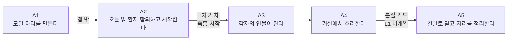
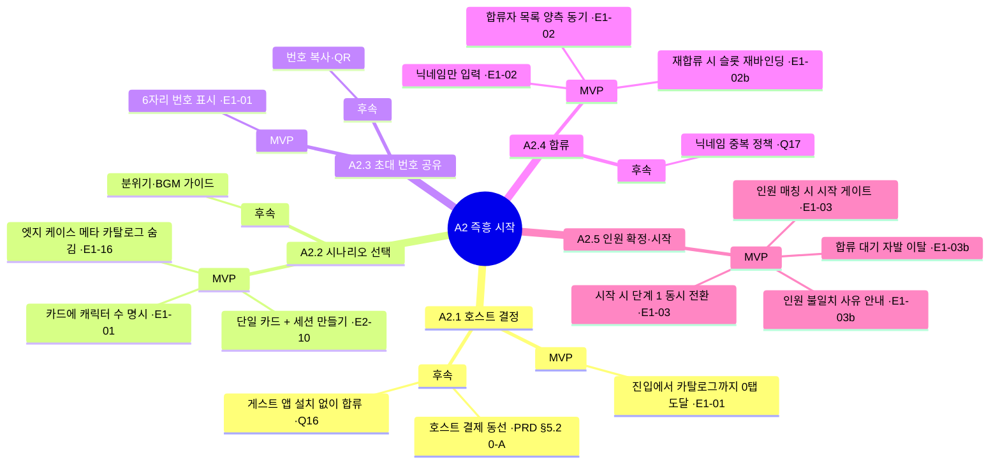
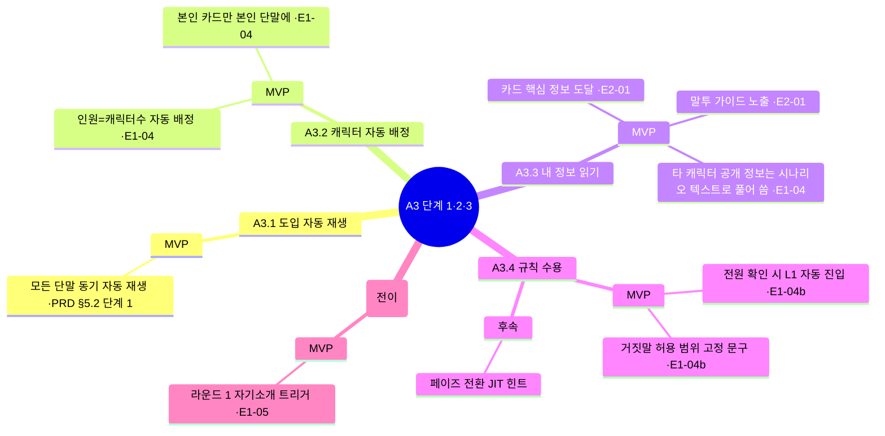
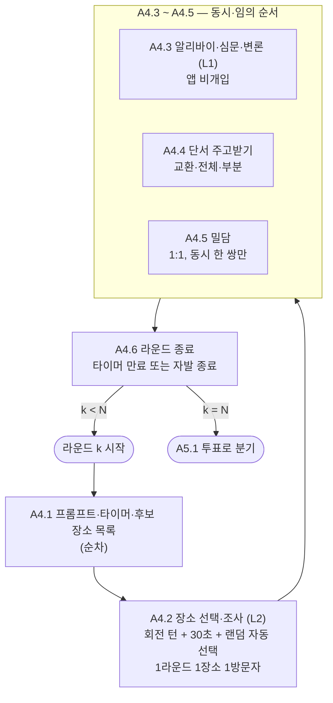
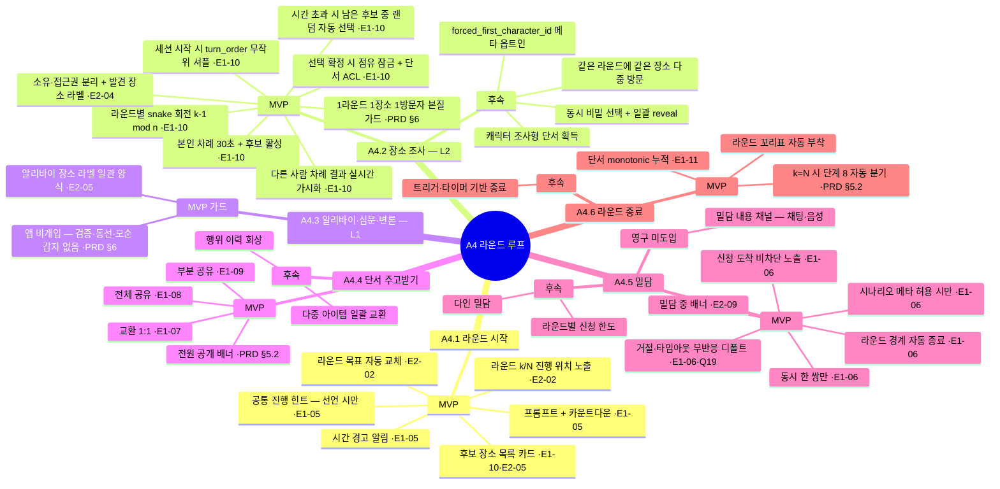
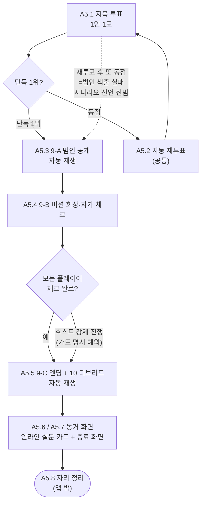
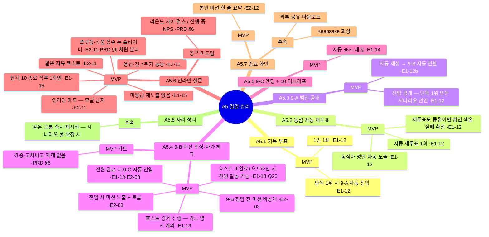

# User Story Map: BYOD 머더 미스터리 플랫폼 (MVP)

**Date:** 2026-04-29
**Skill applied:** [.claude/skills/user-story-mapping/SKILL.md](../../.claude/skills/user-story-mapping/SKILL.md)

**Approach:** 방식 B — 처음부터 새로 정리. PRD의 *앱 책임* 표를 그대로 옮기지 않고, **거실에 모인 친구들이 실제로 무엇을 하는가**(사용자 행동)에서 출발해 backbone을 짰다. 그 결과 PRD가 다루지 않은 *오프라인 마찰*(자리 잡기, 누가 호스트할지 정하기, 자리 정리)이 매핑에 포함된다 — 이는 의식적이며, MVP 스코프 밖 칸도 매핑에 남겨 *어디부터 앱이 돕고 어디까지는 사람이 한다*를 가시화한다.

**Upstream sources:**

- [01-prd-byod-murder-mystery.md](./01-prd-byod-murder-mystery.md) — PRD §3 페르소나, §5.2 메커니즘
- [02-user-stories-byod-murder-mystery.md](./02-user-stories-byod-murder-mystery.md) — Epic 1·2 user stories (매핑 후 역추적용)
- [../01-discovery/03-game-flow-reference.md](../01-discovery/03-game-flow-reference.md) — 게임 플로우 표준 구조

**Downstream:**

- 본 맵의 누락 칸·재배치 신호는 PRD §8 Open Questions 또는 user stories 추가/분할(E*-NNb)로 수렴

---

## 1. Context

### 1.1 Segment

같은 공간에 모인 20–30대 친분 친구 3–6명 그룹. 머더 미스터리 경험은 그룹 안에서 제각각 (처음·경험자 혼재 가능).

### 1.2 Personas (멀티 스윔레인)

본 맵은 두 페르소나의 행동을 가로축 동일 시점에서 동시에 본다.

- **호스트 (Host):** 모임에서 앱을 처음 여는 친구 1인. PRD §3.2 "평소 GM 역할자"의 후신이지만, 본 제품에서는 *플랫폼이 메타 부담을 흡수해 본인도 플레이어로 복귀*하는 것이 가치. 비대칭 부담은 **세션 개시(A2)·9-B 강제 진행(A5.4 — §6 가드 명시 예외)** 두 곳에만 남는다 (PRD §6) — 단계 8 동점은 자동 재투표 1회 → 또 동점이면 *범인 색출 실패*로 자동 확정
- **플레이어 (Player):** 호스트 포함, 게스트로 합류한 모두. 게임 진행 중 두 페르소나의 행동은 거의 일치한다 — 비대칭은 **A2.5 (인원 확정·시작)·A5.4 (호스트 강제 진행)** 두 단계로 한정. PRD §6 가드: *"신규 모듈은 Host 비대칭을 늘리지 않을 것"*

### 1.3 Narrative (Jobs-to-be-Done)

> **모인 그 자리에서 바로 시작해, 한 사람이 진행자에 묶이지 않은 채 전원이 캐릭터에 몰입하는 머더 미스터리를 한 편 끝까지 완주한다.**

한 문장 안에 두 가치가 모두 들어간다 — *즉흥 시작*(1차)과 *한 편 완주*(전 페이즈에 걸친 몰입 보존).

---

## 2. Backbone (Activities)

사용자 행동 언어로 5개의 활동. 각 활동은 시간 순서로 좌→우 진행.

| # | 활동 | 본질 | 앱 개입도 |
|---|------|------|------------|
| **A1** | 모일 자리를 만든다 | 약속·도착·자리 잡기 | 거의 없음 (앱 밖) |
| **A2** | 오늘 뭐 할지 합의하고 시작한다 | 호스트 결정 → 시나리오 선택 → 합류 | **1차 가치 (즉흥 시작)** |
| **A3** | 각자의 인물이 된다 | 캐릭터·정보·규칙 흡수 | 단계 1·2·3 자동 |
| **A4** | 거실에서 추리한다 | 라운드 루프 — 단서·알리바이·밀담·교환 | **본질 가드 (L1 비개입)** |
| **A5** | 결말로 닫고 자리를 정리한다 | 투표·범인 공개·미션 회상·디브리프·설문 | 자동 진행 + 옵트인 설문 |

각 활동의 step은 §3에서, 우선순위(MVP/후속)는 §4 release line에서 결정.

---

## 3. Activity Detail (Steps × Swim Lanes)

각 활동 아래에 Host 스윔레인과 Player 스윔레인을 두고, 단계마다 양쪽이 *그 시점에 무엇을 하는가*를 나란히 표시한다. 비대칭이 발생하는 단계는 한쪽 칸이 비거나(`—`) "함께"로 표시된다.

### A1. 모일 자리를 만든다 *(앱 개입 거의 없음 — 맥락 보존용)*

| Step | Host 스윔레인 | Player 스윔레인 |
|------|---------------|-----------------|
| **A1.1 약속을 잡는다** | 친구들에게 "오늘 머더 미스터리 어때?" 제안 / 모일 장소·시간 합의 / 인원 가늠 (3–6명) | 일정 합의 / 갈지 말지 결정 |
| **A1.2 모인다** | 자리 세팅 (테이블·조명·음료) / 와이파이·충전기 안내 | 도착 / 인사·근황 토크 |
| **A1.3 분위기를 만든다** | "그럼 시작할까?" 분위기 환기 | 폰 꺼내기·충전기 연결 |

**비고:** A1은 본 제품 스코프 밖이지만, A1.3에서 *분위기가 식기 전*에 A2로 진입할 수 있어야 1차 가치(즉흥 시작)가 작동한다. → A2의 "5분 이내 단계 1 진입" 목표가 여기서 정당화된다.

---

### A2. 오늘 뭐 할지 합의하고 시작한다 *(1차 가치 — 즉흥 시작)*

| Step | Host 스윔레인 | Player 스윔레인 |
|------|---------------|-----------------|
| **A2.1 호스트 결정** | "내가 열게" 자청 또는 그룹이 지목 / 앱 설치·실행 | "OO이가 해" 양보 / 폰 준비 |
| **A2.2 시나리오 선택** | 카탈로그 진입 / 단일 카드 정보(인원·시간·요약) 확인 / 인원과 맞는지 즉시 가늠 / *"세션 만들기"* 탭 | 호스트 화면 너머로 슬쩍 보거나 호스트가 읽어주는 요약 듣기 |
| **A2.3 초대 번호 공유** | 6자리 번호 큰 글씨로 보고 친구들에게 부른다 / 합류자 목록이 채워지는 걸 본다 | 호스트가 부르는 번호를 듣는다 / 앱 실행 또는 진입 화면 진입 |
| **A2.4 합류** | 합류자 닉네임이 자기 화면에 추가되는 걸 본다 / 인원이 시나리오 캐릭터 수와 맞는지 본다 | 번호·닉네임 입력 / 합류 확정 피드백 받음 / 합류 대기 화면에서 다른 합류자 닉네임이 추가되는 걸 본다 |
| **A2.5 인원 확정·시작** | 인원이 정확히 일치하면 *"게임 시작"* 활성화 / 탭하여 모두를 단계 1로 동시 전환 | 자기 단말이 단계 1로 자동 전환되는 걸 본다 |

#### Tasks (A2)

> 구체적 UI 카피·배치·인터랙션 디테일은 구현·디자인 단계에서 결정. 본 맵은 *어떤 케이퍼빌리티*가 *어느 단계*에 *어느 우선순위*로 들어가는지를 본다.

| Step | Task (Host/Player 표시 — 공통은 *공통*) | MVP/후속 | 추적 |
|------|----------------------------------|---------|------|
| A2.1 | (Host) 회원가입·로그인 화면 없이 첫 진입에서 카탈로그까지 0탭 | **MVP** | E1-01 |
| A2.1 | (Host) 결제가 필요한 경우 호스트 1인이 결제 | 후속 | PRD §5.2 0-A |
| A2.1 | (Player) 게스트는 앱 설치 없이 합류 가능한 경로 (웹/QR) | 후속 (검증 필요) | PRD §8 Q16 |
| A2.2 | (Host) 단일 카드 + *"세션 만들기"* 버튼만 노출 (필터·소트·랜덤 없음) | **MVP** | E2-10 |
| A2.2 | (Host) 시나리오당 캐릭터 수가 카드에 명시되어 인원 매칭 즉시 가능 | **MVP** | E1-01 |
| A2.2 | (Host) 시나리오 카드에 추천 분위기·BGM 가이드 | 후속 | — |
| A2.2 | *공통* 메타 파싱 실패 + 엣지 케이스 하한선(캐릭터 수 < 3, 라운드 수 N < 2) 위반 시나리오는 카탈로그에 안 뜸 | **MVP** | E1-16, PRD §7.2 메타 스키마 하한선 |
| A2.3 | (Host) 6자리 숫자 초대 번호 표시 | **MVP** | E1-01 |
| A2.3 | (Host) 번호 복사·QR 토글 | 후속 | — |
| A2.4 | (Player) 회원가입·로그인 없이 닉네임만 입력 | **MVP** | E1-02 |
| A2.4 | *공통* 합류자 목록이 양쪽 화면에 즉시 동기 | **MVP** | E1-02 |
| A2.4 | (Player) 닉네임 중복 처리 정책 | 후속 | PRD §8 Q17 |
| A2.4 | *공통* 진행 중 세션에 같은 초대 번호 + 같은 닉네임 재입력 시 기존 슬롯 재바인딩 (네트워크 끊김·앱 크래시 복구) | **MVP** | E1-02b |
| A2.5 | (Host) 합류자 수 ≠ 시나리오 캐릭터 수면 *"게임 시작"* 비활성 | **MVP** | E1-03 |
| A2.5 | (Host) 인원 불일치 사유 인라인 안내 | **MVP** | E1-03b |
| A2.5 | (Player) 합류 대기 화면 *"나가기"* 컨트롤 — 자발 이탈로 J 1 감소 (호스트 강제 추방은 §6 가드상 도입 안 함) | **MVP** | E1-03b |
| A2.5 | *공통* *"게임 시작"* 탭 즉시 모든 단말이 단계 1로 동기 전환 | **MVP** | E1-03 |

**갭 발견 (방식 B 효과):** A2.1의 "앱 설치 vs 웹 진입"과 A2.4의 "닉네임 중복"은 본 맵의 *플레이어 스윔레인*에 두면서 비로소 합류 시점 마찰로 명시화되어 PRD §8 Q16·Q17로 승격되었다. A2.5의 "인원 불일치 사유 안내"는 E1-03b로 분할되어 MVP에 들어왔다. (결제 동선은 계속 후속.)

---

### A3. 각자의 인물이 된다 *(단계 1·2·3 — 선형 오프닝)*

| Step | Host 스윔레인 | Player 스윔레인 |
|------|---------------|-----------------|
| **A3.1 도입을 본다 (단계 1)** | (호스트도 플레이어로 함께) 도입 텍스트/오디오 자동 재생 시청 | 도입 자동 재생 시청 / 분위기 흡수 |
| **A3.2 캐릭터를 받는다 (단계 2)** | 본인 카드 자동 배정 받음 | 본인 카드 자동 배정 받음 / 다른 사람 화면 안 봄 |
| **A3.3 내 정보를 읽는다** | 카드의 이름·배경·동기·알리바이·비밀·관계·말투 가이드 정독 | 동일 |
| **A3.4 규칙을 받아들인다 (단계 3)** | 인앱 튜토리얼 1회 읽음 / "확인" 탭 | 동일 / 모두가 확인하면 자동 L1 진입 |
| **A3.5 첫 대화를 연다 *(A4.1과 시점 동일 — 전이 단계)*** | (호스트도 플레이어로 함께) 자기 캐릭터 소개 발화 | 자기 캐릭터 소개 / 옆 사람 캐릭터 듣기 |

#### Tasks (A3)

| Step | Task | MVP/후속 | 추적 |
|------|------|---------|------|
| A3.1 | *공통* 모든 단말 동기 자동 재생 (수동 "다음" 누름 없음) | **MVP** | PRD §5.2 단계 1 |
| A3.2 | *공통* 캐릭터 자동 배정 (인원 = 캐릭터 수) | **MVP** | E1-04 |
| A3.2 | *공통* 본인 단말에만 본인 카드 노출, 다른 캐릭터 필드는 자동 동기 안 됨 | **MVP** | E1-04 |
| A3.3 | *공통* 카드에서 모든 핵심 정보 도달 | **MVP** | E2-01 |
| A3.3 | *공통* 말투 가이드가 있으면 카드에 상시 노출 | **MVP** | E2-01 |
| A3.3 | (Player) 다른 캐릭터 *공개 정보*(이름·직업)는 시나리오 저자가 도입 텍스트나 단계 2 소개 멘트로 직접 풀어 씀 | **MVP** | E1-04 (필드별 disclosure 라벨은 후속) |
| A3.4 | *공통* 거짓말 허용 범위(`all_players` 단일 정책) 고정 문구 안내 | **MVP** | E1-04b |
| A3.4 | *공통* 모든 합류자 "확인" 통과 시 L1 자동 전환 | **MVP** | E1-04b |
| A3.4 | *공통* 페이즈 전환 시 JIT 맥락 힌트 | 후속 | E1-04b 명시 후속 |
| A3.5 | *공통* 첫 라운드 진입 시 자기소개 발화 트리거 프롬프트 | **MVP** | E1-05 (k=1 한정 자기소개 트리거 AC로 합성됨) |

**갭 발견 (해결됨):** A3.5 "첫 대화를 연다"는 PRD에서 단계 3과 L1 사이에 명시되지 않은 *사회적 마찰 지점*이었다. 모두가 카드를 다 읽었지만 "그래서 누가 먼저 말해?"가 비어 있으면 분위기가 식는다. → E1-05 AC에 *k=1 한정 자기소개 발화 트리거*가 합성되어 MVP에 포함됨.

**시점 정합성 노트 (F1):** A3.5는 시간상 라운드 1 시작(A4.1)과 **동일 시점**이다. E1-05 AC가 "라운드 k=1 진입 시" 자기소개 트리거를 동봉하므로, 트리거 자체는 A4.1에서 발생하고 그 직후의 *발화 행위*가 A3.5에 해당한다. 매핑 시각화상 A3 활동 끝과 A4 활동 시작이 *겹치는 전이 단계*로 본다 — A3 종료 의식(자기소개)이 곧 A4 개시 트리거.

---

### A4. 거실에서 추리한다 *(L1·L2 루프 N회 — 본질 가드)*

루프는 N회 반복되지만 매핑은 *한 라운드 안의 사용자 행동*으로 본다. 라운드 간 차이는 task 단위에서 표시.

**병렬성 비고 (F9·NF3):** PRD §5.2의 "L1·L2"는 *시간 순서가 아닌 개념 라벨*이다 — L1(알리바이·심문·변론)과 L2(증거·단서 배포)는 한 라운드 안에서 **동시 진행되는 두 트랙**이며, L2의 단서는 *플레이어가 후보 장소 중 1곳을 선택해 조사한 결과로* 풀려나온다. 따라서 매핑의 A4.2~A4.5는 좌→우 직선이 아니라 다음 구조다:

- **A4.1 (라운드 시작) → 순차** — 프롬프트·타이머·후보 장소 목록 노출
- **A4.2 (장소 선택·조사) → 회전 턴 순차 진행** — *정보 비대칭 + 추리 경쟁* 본질을 보존하기 위해 1라운드 1장소 1방문자 규칙 적용. 세션 시작 시 무작위 셔플로 결정된 `turn_order` 기반, 라운드별 snake 회전(`(k-1) mod n`)으로 본인 차례에 30초 안에 후보 1곳 탭. 시간 초과 시 남은 후보 중 랜덤 자동 선택. 본인 차례 외에는 후보 카드가 비활성이며 다른 사람의 선택 결과는 실시간으로 모든 단말에 가시화 — *남의 선택을 보고 본인 선택을 결정*하는 추리 결정 자체가 게임 행위
- **A4.3(L1 이야기) · A4.4(단서 주고받기) · A4.5(밀담) → 동시·임의 순서** — 한 쌍이 밀담 중인 동안 다른 셋이 알리바이 토론하면서 동시에 단서를 교환하는 모습이 정상 흐름
- **A4.6 (라운드 끝) → 순차** — 타이머 종료 또는 자발 종료, 분기 진입

매핑이 A4.2~A4.5를 좌→우 행으로 그리는 것은 시각화 도구 한계이며 시간 순서를 의미하지 않는다.

| Step | Host 스윔레인 | Player 스윔레인 |
|------|---------------|-----------------|
| **A4.1 라운드의 시작을 받는다** | (Host도 플레이어로 함께) 프롬프트·타이머·후보 장소 목록 받음 | 동일 — 자기 라운드 목표 카드 자동 갱신 |
| **A4.2 장소를 조사한다 (L2)** | (Host도 플레이어로 함께) 본인 차례에 30초 안에 후보 장소 1곳 탭 → 점유 잠금 → 단서 도착 / 시간 초과 시 랜덤 자동 선택 | 동일 / 다른 사람 차례엔 후보 비활성, 그 사람의 선택 결과만 실시간 가시화하여 본인 차례 결정에 활용 |
| **A4.3 같이 이야기한다 (L1)** | (Host도 플레이어로 함께) 알리바이·심문·변론 발화 | 동일 / 카드 한 번의 탭으로 알리바이 장소 라벨 확인 |
| **A4.4 단서를 주고받는다** | 교환·전체 공유·부분 공유 행위 / 전원 배너 보고 누가 누구에게 줬는지 인지 | 동일 |
| **A4.5 따로 빠진다 (밀담)** | 시나리오가 허용한 경우 1:1 밀담 신청·수락·거절·종료 | 동일 / 다른 쌍 진행 중이면 신청 비활성 |
| **A4.6 라운드를 끝낸다** | 타이머 종료 또는 자발 종료 / **k < N이면 다음 라운드(A4.1) 자동 진입, k = N(마지막 라운드)이면 단계 8 투표(A5.1) 자동 진입** | 동일 / 누적 단서가 사라지지 않음을 확인 |

#### Tasks (A4)

| Step | Task | MVP/후속 | 추적 |
|------|------|---------|------|
| A4.1 | *공통* 라운드별 프롬프트 + 카운트다운 자동 노출 | **MVP** | E1-05 |
| A4.1 | *공통* 시간 경고 임계점 알림 | **MVP** | E1-05 |
| A4.1 | *공통* L2 진입 시 후보 장소 목록 카드 (시나리오 메타의 `location_pool`) | **MVP** | E1-10, E2-05 |
| A4.1 | *공통* 카드 라운드 목표 자동 교체 (이전 라운드 회상 컨트롤은 후속) | **MVP** | E2-02 |
| A4.1 | *공통* *"라운드 k / N"* 진행 위치 상시 노출 (마지막 라운드 인지 = 추리 전략 결정 포인트) | **MVP** | E2-02 |
| A4.1 | *공통* 시나리오 메타에 `common_hint`가 선언된 라운드에 한해 라운드 프롬프트 카드와 함께 *공통 진행 힌트* 평문 노출 (모든 단말 동시 동일 텍스트, L2 단서 ACL 밖, 미선언 라운드는 노출 없음). 진행 보조 메타 가이드든 서사 공개 사실이든 시나리오 저자 재량이며 § 6 *1라운드 1장소 1방문자* 가드와 무관 — 도입 텍스트와 동일한 저자 통제 공개 채널 | **MVP** | E1-05 |
| A4.2 | *공통* 1라운드 1장소 1방문자 본질 — *정보 비대칭 + 추리 경쟁* 보존 | **MVP** (가드) | PRD §6, E1-10 |
| A4.2 | *공통* 세션 시작 시(A2.5) `turn_order` 무작위 셔플 1회 확정 | **MVP** | E1-10 |
| A4.2 | *공통* 라운드 k 시작 인덱스 `(k - 1) mod n` snake 회전 + *"이번 라운드 조사 순서"* 카드 노출 | **MVP** | E1-10 |
| A4.2 | *공통* 본인 차례에만 후보 카드 활성화 + 30초 카운트다운 | **MVP** | E1-10 |
| A4.2 | *공통* 본인이 30초 안에 후보 1곳 탭 시 점유 잠금 + 단서 도착 (Item ACL 메커니즘 재사용) | **MVP** | E1-10 |
| A4.2 | *공통* 30초 시간 초과 시 남은 후보 중 랜덤 자동 선택 — *"X 조사 중 (자동 선택)"* 표시, 모두가 매 라운드 단서 1개 보장 | **MVP** | E1-10 |
| A4.2 | *공통* 다른 사람 차례엔 후보 비활성 (*"X 차례 — 30초"* 표시), 선택 결과는 실시간 가시화 | **MVP** | E1-10 |
| A4.2 | *공통* 선점 장소는 *"OO이 조사 중"* 점유자 닉네임으로 라운드 경계까지 비활성 | **MVP** | E1-10 |
| A4.2 | *공통* 같은 라운드에 같은 장소 다중 방문 / 캐릭터 조사형 단서 / 동시 비밀 선택 + 일괄 reveal / 시나리오 메타 `forced_first_character_id` 옵트인 | 후속 | — |
| A4.2 | *공통* 카드 아이템 영역에 "소유" / "접근권 보유" 분리 + 발견 장소 라벨 | **MVP** | E2-04 |
| A4.3 | *공통* 카드의 알리바이 장소 라벨이 L-Vis 1 일관 양식 | **MVP** | E2-05 |
| A4.3 | *공통* **앱은 검증·동선 추리·모순 감지를 하지 않음 (L1 비개입)** | **MVP** (가드) | PRD §6 |
| A4.4 | *공통* 교환(1:1) — 양측이 두 아이템 모두 접근권, 소유는 이동 | **MVP** | E1-07 |
| A4.4 | *공통* 전체 공유 — 소유 유지, 전원 접근권 | **MVP** | E1-08 |
| A4.4 | *공통* 부분 공유 — 지정 N명에게만 접근권, 비대상자엔 내용 비표시 | **MVP** | E1-09 |
| A4.4 | *공통* 전원 공개 배너 (라운드 N: A → B (행위)) — 항상 켬 | **MVP** | PRD §5.2 아이템 모듈 |
| A4.4 | *공통* 행위 이력 회상(역순 타임라인) | 후속 | PRD §5.2 명시 후속 |
| A4.4 | *공통* 다중 아이템 일괄 교환 | 후속 | PRD §7.2 |
| A4.5 | *공통* `allow_private_talk: true` 시나리오에서만 신청 컨트롤 노출 | **MVP** | E1-06 |
| A4.5 | *공통* B 단말에 신청 도착 시 비차단 노출 — "수락"/"거절" 동등 시각 가중 | **MVP** | E1-06 |
| A4.5 | *공통* 동시 한 쌍만 — 다른 쌍 진행 중 신청 컨트롤 전원 비활성 | **MVP** | E1-06 |
| A4.5 | *공통* 모든 단말에 "A, B 밀담 중" 배너 (참여자를 쉼표로 나열) | **MVP** | E2-09 |
| A4.5 | *공통* 라운드 경계 도달 시 자동 종료 | **MVP** | E1-06 |
| A4.5 | *공통* 거절·타임아웃·미응답이 어느 단말에도 자동 노출되지 않음 (세 결과 동일 무반응) | **MVP** (디폴트) | E1-06, PRD §8 Q19 |
| A4.5 | *공통* 밀담 내용 채널(채팅·음성) | **영구 미도입** | PRD §5.2 — 대화는 대면 |
| A4.5 | *공통* 다인 밀담 (3인 이상) | 후속 | PRD §7.2 |
| A4.5 | *공통* 라운드별 신청 횟수 한도 | 후속 | PRD §7.2 |
| A4.6 | *공통* 단서 monotonic 누적 (이전 라운드 단서 안 사라짐) | **MVP** | E1-11 |
| A4.6 | *공통* 라운드 꼬리표 모든 이벤트·로그에 자동 부착 | **MVP** | PRD §5.2 |
| A4.6 | *공통* 트리거·타이머 기반 종료 (고정 횟수 N 외) | 후속 | PRD §5.2 |
| A4.6 | *공통* 마지막 라운드(k = N) 종료 시 단계 8(A5.1)로 자동 분기 진입 | **MVP** | PRD §5.2 — 루프 종료 조건은 고정 횟수 N |

**비대칭 비고:** A4 전 구간에서 Host 스윔레인은 Player 스윔레인과 **거의 동일**하다 — 이것이 PRD §3.2의 "GM 역할자 본인도 플레이어로 복귀" 가치가 작동한다는 신호. 매핑이 두 칸을 동일 task로 채우는 모습 자체가 *가치 검증 가시화*.

---

### A5. 결말로 닫고 자리를 정리한다 *(단계 8·9·10·11 + 종료)*

| Step | Host 스윔레인 | Player 스윔레인 |
|------|---------------|-----------------|
| **A5.1 지목 투표** | (Host도 플레이어로 함께) 1표 행사 / **단독 1위면 A5.2 건너뛰고 A5.3(범인 공개) 자동 진입, 동점이면 A5.2(동점 처리)로 분기** | 동일 / 결과 화면 대기 |
| **A5.2 동점 자동 재투표** | (Host도 플레이어로 함께) 동점자 명단 자동 노출 후 재투표 1표 행사 / **재투표도 동점이면 *범인 색출 실패*로 확정 → 9-A에서 시나리오 선언 진범 공개** | 동일 / 재투표 1표 행사 |
| **A5.3 범인 공개를 본다** | (Host도 플레이어로 함께) 9-A 자동 재생 | 동일 |
| **A5.4 미션을 회상하고 체크한다** | 9-B 카드 미션 처음 노출 / ✓·✗ 자가 체크 | 동일 |
| **A5.5 결말과 디브리프를 듣는다** | 9-C 단일 엔딩 텍스트 + 10 디브리프 자동 재생 시청 | 동일 |
| **A5.6 의견을 남길지 정한다 (11)** *(A5.7과 동일 화면 — 인라인 카드 동거 상태)* | 인라인 설문 카드 보고 응답 또는 건너뛰기 / 어느 쪽이든 카드 dismiss → A5.7로 자동 노출 | 동일 |
| **A5.7 종료 화면을 본다** *(A5.6 카드 dismiss 후 동일 화면)* | "수고했어요" + 본인 미션 한 줄 요약 | 동일 |
| **A5.8 자리를 정리한다** | 친구들과 즉석 회상 / 정리·해산 | 동일 |

#### Tasks (A5)

| Step | Task | MVP/후속 | 추적 |
|------|------|---------|------|
| A5.1 | *공통* 1인 1표 (중복 입력 시 본인 1표만 반영) | **MVP** | E1-12 |
| A5.1 | *공통* 단독 1위 시 9-A 자동 진입 | **MVP** | E1-12 |
| A5.2 | *공통* 동점 시 동점자 명단 자동 노출 + 재투표 1회 자동 트리거 (호스트 결정 동선 없음) | **MVP** | E1-12 |
| A5.2 | *공통* 재투표 결과도 동점이면 *범인 색출 실패*로 확정 → 9-A에서 시나리오 선언 진범 공개 | **MVP** | E1-12 |
| A5.3 | *공통* 9-A 범인 공개 내레이션 자동 재생 → 9-B 자동 전환 | **MVP** | E1-12b |
| A5.3 | *공통* 단독 1위(또는 재투표 단독 1위)면 그 캐릭터, *범인 색출 실패*(재투표도 동점)면 시나리오 저자가 선언한 *진짜 범인*(`true_culprit_character_id`)을 9-A에서 공개 (실패 프레임: *"여러분은 색출에 실패했습니다 — 진범은 X였다"*) | **MVP** | E1-12, PRD §5.2 단계 9-A |
| A5.4 | *공통* 9-B 진입 전 미션 비공개 (자리표시자) | **MVP** | E2-03 |
| A5.4 | *공통* 9-B 진입 시 1–3개 미션 첫 노출 + ✓/✗ 토글 | **MVP** | E2-03 |
| A5.4 | *공통* "체크 완료" 신호 수집 — 모든 플레이어 완료 시 9-C 자동 진입 | **MVP** | E1-13, E2-03 |
| A5.4 | (Host) 첫 "체크 완료" 후 일정 시간(현재 3분) 경과 시 *"강제 진행"* 컨트롤 노출 — 미완료자는 `null`로 기록 후 9-C 진입 (§6 가드 명시 예외, NF6) | **MVP** | E1-13, PRD §6 (c) |
| A5.4 | *공통* 호스트 본인이 미완료 + 오프라인 시 강제 진행이 모든 합류자에게 노출 (NB3 좁은 인계 예외) | **MVP** | E1-13, PRD §8 Q20 |
| A5.4 | *공통* 자가 체크 결과 그대로 저장, 검증·교차 비교·제재 없음 | **MVP** (가드) | E1-13, PRD §6 |
| A5.5 | *공통* 9-C 단일 엔딩 텍스트 자동 표시 → 10 디브리프 자동 재생 | **MVP** | E1-14 |
| A5.6 | *공통* 단계 10 종료 직후 1회만 노출, 단계 1~10 트리거 차단 | **MVP** | E1-15 |
| A5.6 | *공통* 인라인 카드 (모달 금지) | **MVP** | E2-11 |
| A5.6 | *공통* 플랫폼 점수 + 작품 점수 두 슬라이더 동거 (둘 다 미응답 허용) | **MVP** | E2-11, PRD §6 차원 분리 가드 |
| A5.6 | *공통* 짧은 자유 텍스트 한 칸 (정확한 문자수 제한은 PRD §3.6 참조) | **MVP** | E2-11 |
| A5.6 | *공통* "응답하기"·"건너뛰기" 동등 시각 가중 + 탭 시 즉시 dismiss → A5.7 단독 노출 | **MVP** | E2-11 |
| A5.6 | *공통* 미응답 재노출 없음 | **MVP** | E1-15 |
| A5.6 | *공통* 라운드 사이 펄스 설문 / 게임 진행 중 NPS 카드 | **영구 미도입** | PRD §6 가드 |
| A5.7 | *공통* 본인 미션 한 줄 요약 + 종료 메시지 | **MVP** | E2-12 |
| A5.7 | *공통* Keepsake 회상 화면 (아이템 행위 이력 등) | 후속 | E2-12 명시 후속 |
| A5.7 | *공통* 외부 공유·다운로드 컨트롤 | 후속 (검증 필요) | E2-12 |
| A5.8 | *공통* 같은 친구 그룹으로 다른 시나리오 즉시 재시작 | 후속 (시나리오 풀 확장 시) | — |

**갭 발견:** A5.8 "같은 그룹으로 즉시 재시작" 동선은 1편 시나리오 MVP에서는 비어 있다 — 시나리오 풀이 1편이라 재시작할 게 없음. 시나리오 2편째에서 *세션 종료 → 다음 시나리오 카탈로그 → 새 초대 번호*의 단축 동선이 자연스럽게 요구될 것. **후속 신호로 보존.**

---

## 4. Release Line (수직 우선순위)

각 task에 `**MVP**` / `후속` / `영구 미도입`을 표시했다. 가로 release line을 그리면:

### 4.1 MVP 라인 (출시 시점에 작동해야 하는 것)

A1 전부 (앱 밖) + A2 전 단계 핵심 + A3 단계 1·2·3 자동 진행 + A4 라운드 루프(타이머·프롬프트·조사 장소·아이템 3행위·밀담·monotonic 누적) + A5 투표·9-A·9-B·9-C·10·11·종료 화면.

**MVP 라인의 특징:**
- 1차 가치(즉흥 시작): A2 전체가 MVP
- 본질 가드(L1 비개입): A4.3·A5.4가 *기능 추가가 아니라 기능 제거*로 MVP
- 차원 분리(설문): A5.6의 두 슬라이더 동거가 MVP — *합치는 단순화는 가드 위반*

### 4.2 후속 라인 (시나리오 풀 확장 또는 검증 후)

- A2.1 결제 / 게스트 웹 진입 / 닉네임 중복 처리
- A2.2 카탈로그 필터·소트·랜덤·다편 그리드
- A4.2 같은 라운드에 같은 장소 다중 방문 / 캐릭터 조사형 단서 획득 / 동시 비밀 선택 + 일괄 reveal / 시간 제한 메타 선언 / 시나리오 메타 `forced_first_character_id` 옵트인
- A4.4 행위 이력 회상 / 다중 아이템 일괄 교환
- A4.5 다인 밀담 / 동시 다중 1:1 밀담 / 라운드별 신청 횟수 한도
- A4.6 트리거·타이머 기반 루프 종료
- A5.7 Keepsake 회상 화면
- A5.8 같은 그룹 즉시 재시작 동선

### 4.3 영구 미도입 라인 (가드)

- A4.5 밀담 내용 채널 (채팅·음성) — 대화는 대면
- A5.6 라운드 사이 펄스 설문 / 진행 중 NPS — 측정하려는 몰입을 파괴

---

## 5. 갭·신호 요약 (방식 B의 산출)

방식 B로 새로 정리하며 PRD/유저 스토리에 명시되지 않았거나 약하게 다뤄진 칸을 발견했다. 본 맵의 가장 큰 가치는 *이 목록*이다.

| # | 칸 | 신호 | 처리 상태 |
|---|------|------|----------|
| **G1** | A2.1 (Player) 게스트가 앱 설치 없이 합류할 경로 | "이미 모인" 친구가 앱 설치를 시작하면 즉흥성이 깨짐. 웹/QR 진입 경로 미검증 | **처리 완료** — [PRD §8 Q16](./01-prd-byod-murder-mystery.md)으로 승격, 재방문 트리거(첫 5세션 합류 시간 > 5분) 명시 |
| **G2** | A2.2 시나리오당 캐릭터 수 단일 정수와 합류 인원 매칭 안내 | E1-03 AC가 "비활성"으로만 처리. 인원 부족 사유를 보여주지 않으면 호스트가 디버깅함 | **처리 완료** — [E1-03b](./02-user-stories-byod-murder-mystery.md) 신설, *"X명 더 필요"* / *"X명 초과"* 인라인 표시 |
| **G3** | A2.4 닉네임 중복 처리 | 매핑에서 *합류 시점 마찰*로 가시화 | **처리 완료** — [PRD §8 Q17](./01-prd-byod-murder-mystery.md)로 승격, 재방문 트리거(첫 5세션 중 충돌 1회 이상) 명시 |
| **G4** | A3.5 "첫 대화를 연다" 사회적 마찰 | 단계 3 → L1 사이의 *발화 트리거* 부재 시 분위기 식음. PRD에 명시 없음 | **처리 완료** — [E1-05 AC](./02-user-stories-byod-murder-mystery.md)에 라운드 1 자기소개 트리거 합성 |
| **G5** | A4 Host·Player 스윔레인 동일 | "Host가 플레이어로 복귀" 가치가 매핑상 *시각적으로* 검증됨 — 비대칭이 A2.5·A5.4 두 곳에 한정 (A5.4는 §6 가드 명시 예외 — 세션 미종료 회피용 안전 장치) | **처리 완료** — [PRD §6](./01-prd-byod-murder-mystery.md)에 *"신규 모듈은 Host 비대칭을 늘리지 않을 것"* 가드 등재. NF6/G7 합성 이후 A5.4 강제 진행이 PRD §6 (c) 명시 예외로 추가됨 |
| **G6** | A5.8 같은 그룹 재시작 동선 | 1편 MVP에서는 비어 있지만 2편째에 자연스럽게 요구될 동선 | **처리 완료** — [PRD §8 Q18](./01-prd-byod-murder-mystery.md)로 승격, 재방문 트리거(시나리오 풀 ≥ 2편) + backbone *"A6. 다음 한 편으로 이어간다"* 추가 검토 명시 |
| **G7** | A5.4 → A5.5 사이 *9-B 완료 대기* 사회 마찰 | E1-14 AC가 *"모든 플레이어가 9-B 자가 체크 완료 시 9-C 진입"*. 빠른 체크자가 늦은 체크자를 기다리는 시간이 발생, *"누가 아직 안 했어?"* 발화 가능. PRD에 명시 없음 (G4와 동종). **NF2 도입(명시적 *"체크 완료"* 버튼) 이후 *체크 완료 행동의 binary 가시성*이 추가되어 G7 발생 위험이 더 높아짐** — 단순 ✓·✗ 토글 시절보다 *"누가 아직 버튼 안 눌렀어?"* 압박이 커짐 | **부분 완화 (NF6) + 보류.** NF6의 호스트 *"강제 진행"* 컨트롤(첫 완료 후 3분 경과 시 노출)이 *세션 차단* 위험은 해결하지만, *3분 미만의 짧은 사회 마찰* 자체는 여전히 발생. MVP 운영 첫 5세션에서 *"강제 진행"* 사용 빈도 + 포스트 엔딩 설문의 *"기다림"* 코멘트 누적이 임계점을 넘으면 추가 가드 후보로 승격. 임계점 미만이면 *대기가 즉석 회상 발화의 자연스러운 시간*으로 작동한다고 판단해 가드 미설정 유지 |
| **G8** | A2.2 시나리오 메타의 엣지 케이스 (캐릭터 수 1·2명, 라운드 수 N=1) | 페르소나(친구 3-6명)와 정합 안 되거나 게임 본질이 깨지는 메타 형태. 시나리오 저자가 의도치 않게 만들 수 있음 | **처리 완료** — [PRD §7.2 메타 스키마 하한선](./01-prd-byod-murder-mystery.md)에 *캐릭터 수 ≥ 3, N ≥ 2* 명시 + [E1-16 AC](./02-user-stories-byod-murder-mystery.md)에 하한선 위반 시 카탈로그 숨김 추가 |
| **G9** | 세션 중 네트워크 끊김·앱 크래시 리커버리 동선 부재 | 단말 한 대가 일시 오프라인 또는 앱 종료 시 자기 자리로 복귀하는 메커니즘이 PRD에 없음. 호스트 단말 영구 오프라인 시 세션 막힘 | **단기 처리 완료, 장기 보류** — [E1-02b](./02-user-stories-byod-murder-mystery.md) 신설로 동일 초대 번호 + 동일 닉네임 재합류 시 기존 슬롯 재바인딩(MVP). 호스트 권한 자동 복원 포함. 장기 오프라인 시 호스트 권한 인계는 [PRD §8 Q20](./01-prd-byod-murder-mystery.md)으로 승격, 디폴트는 *"인계 없음"* |
| **G10** | A2.1 첫 호스트 온보딩 동선 부재 | 카탈로그가 곧장 시나리오 카드 노출이라 *"이거 뭐 하는 앱이야"* 단계가 없음 | **의도적 미도입 (가드 등재)** — [PRD §6](./01-prd-byod-murder-mystery.md)에 *"온보딩 튜토리얼·제품 소개 화면을 도입하지 않을 것"* 가드 추가. 1차 가치 *즉흥 시작*은 *"앱 열면 즉시 카탈로그까지 0탭"*에 의존하므로 온보딩 화면이 진입 마찰을 만드는 변경은 가드 위반 |
| **G11** | A4.2 시간 초과 랜덤 자동 선택의 캐릭터 몰입 손상 | 30초 제한 + 시간 초과 시 *남은 후보 중 랜덤 자동 선택*으로 *모두가 매 라운드 단서 1개 보장*은 확보되지만, 본인 의도와 다른 장소가 강제 배정될 수 있어 *"왜 거기 갔냐"*에 *"앱이 자동으로 골랐다"*가 답이 되는 케이스 발생. 캐릭터 몰입 약간 손상 가능 | **MVP 디폴트 채택 + 모니터링.** 30초 제한 + 랜덤 자동 선택을 디폴트로 유지. 첫 5세션에서 *"세션당 시간 초과 자동 선택 발생 평균"* + 설문 자유 텍스트의 *"의도와 다른 장소 강제 배정"* 또는 *"30초 부족"* 코멘트 누적이 임계점을 넘으면 *후속 메커니즘*(예: 시간 제한을 시나리오 메타 선언 가능하게 / 후순위 캐릭터에 가중치를 둔 자동 선택 / 본인이 미리 *"이 장소만 피해"* 우선순위 입력) 도입 검토 |

---

## 6. 다음 단계

- **본 맵 ≠ 백로그.** 본 맵은 사용자 행동 시각화이며 user-story-mapping 스킬 §"What This Is NOT" 원칙에 따라 백로그로 다루지 않는다
- **G1~G6 모두 처리 완료** (§5 표 참조). 이후 신호는 PRD §8의 재방문 트리거가 발동하는 시점에 본 맵을 같이 갱신한다
- **MVP 운영 중 모니터링 항목** — 다음 신호들이 본 맵·PRD §8을 다시 깨우는 트리거. **모집단·기간·임계점·결정 책임자는 [PRD §8.0 공통 규약](./01-prd-byod-murder-mystery.md) 적용** (시스템 전체 첫 5세션 / 출시 후 4주 / 코멘트 ≥ 2건 / 단일 운영자):
  - **합류 단계 평균 시간** (Q16 — 게스트 진입 경로 결정 트리거)
  - **닉네임 충돌 발생 횟수** (Q17 — 닉네임 정책 결정 트리거)
  - **밀담 거절 발생 + "거절 안 보여서 답답" 코멘트** (Q19 — 거절 가시성 디폴트 (c) 유지/전환 트리거)
  - **9-B 강제 진행 사용 빈도 + "기다림" 코멘트** (G7 — NF6 강제 진행이 부분 완화함, 짧은 마찰의 추가 가드 신설 여부 트리거)
  - **A4.2 세션당 시간 초과 자동 선택 발생 평균 + "의도와 다른 장소 강제 배정" 또는 "30초 부족" 코멘트** (G11 — 시간 제한 메타 선언·자동 선택 알고리즘 후속 메커니즘 도입 트리거)
  - **데이터 출처:** §5.3 텔레메트리·로깅 정책에 따라 서버 측 `session_log`에 객관 이벤트 기록, 포스트 엔딩 설문 응답에 주관 신호 기록. 운영자 직접 조회
- **시나리오 2편째 합류 시점**에 본 맵의 backbone에 *"A6. 다음 한 편으로 이어간다"* 활동을 추가할지 결정 (Q18)
- **MVP 운영 첫 5세션에 추가 모니터링 항목 (B 라운드 산출):**
  - **호스트 단말 5분 이상 오프라인 사례 ≥ 1회** (Q20 — 호스트 권한 인계 정책 결정 트리거)
  - 첫 호스트의 **카탈로그 진입 망설임** — *"이게 뭐지"* 발화 + 진입 지연이 누적되면 G10 온보딩 가드 재검토 신호. **구체 임계값(망설임 시간·세션 수)은 첫 5세션 관찰 후 정의** — 사전 정량화하면 실제 친구 그룹의 입장 행동과 어긋날 수 있음. 단, 가드 자체는 1차 가치를 보호하므로 신호 누적이 강해야 가드 변경 검토
